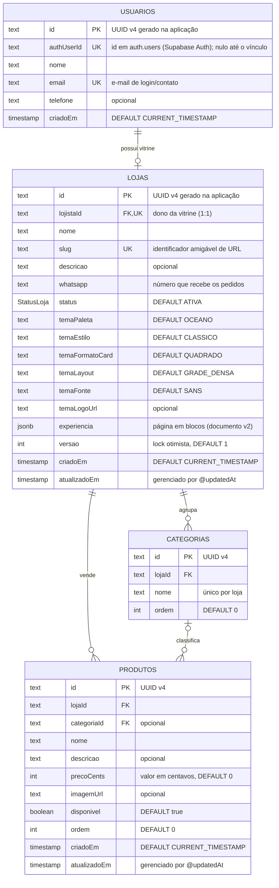
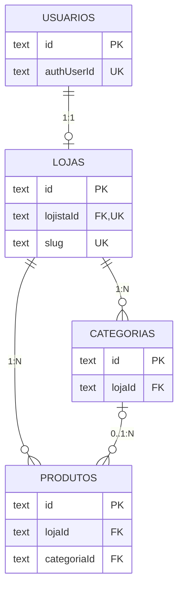
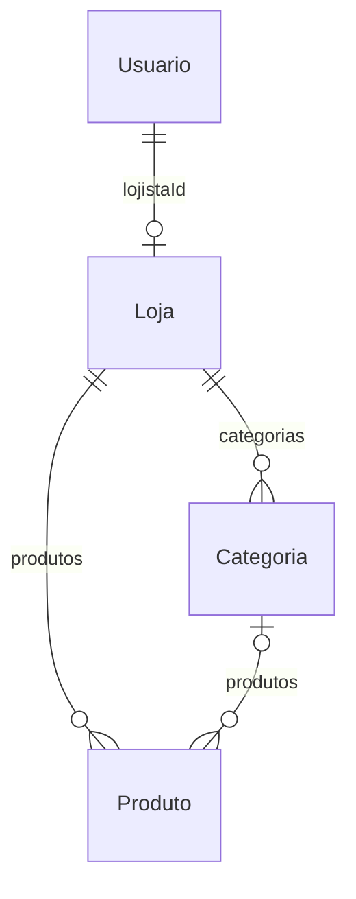

# 1. Modelo Entidade-Relacionamento (ER físico)

> Fonte: `prisma/schema.prisma` · PostgreSQL (Supabase) · DDL do Prisma Migrate.

## 1.1 Diagrama ER completo



## 1.2 Diagrama lógico (somente chaves)



## 1.3 Relacionamentos e integridade referencial

| # | Origem | Destino | Cardinalidade | Coluna(s) | Regra |
| --- | --- | --- | --- | --- | --- |
| R1 | `usuarios` | `lojas` | 1 : 0..1 | `lojas.lojistaId` → `usuarios.id` | `ON DELETE CASCADE`, `ON UPDATE CASCADE`, `UNIQUE` |
| R2 | `lojas` | `categorias` | 1 : 0..N | `categorias.lojaId` → `lojas.id` | `ON DELETE CASCADE`, `ON UPDATE CASCADE` |
| R3 | `lojas` | `produtos` | 1 : 0..N | `produtos.lojaId` → `lojas.id` | `ON DELETE CASCADE`, `ON UPDATE CASCADE` |
| R4 | `categorias` | `produtos` | 0..1 : 0..N | `produtos.categoriaId` → `categorias.id` | `ON DELETE SET NULL`, `ON UPDATE CASCADE`, anulável |

### Leitura das cardinalidades

- **R1 — `||--o|`**: cada usuário tem no máximo **uma** vitrine (garantido pelo
  `UNIQUE` em `lojas.lojistaId`); toda loja pertence a exatamente um usuário.
- **R2 / R3 — `||--o{`**: uma loja pode ter **zero ou muitas** categorias/produtos;
  cada linha pertence a exatamente uma loja.
- **R4 — `o|--o{`**: um produto pode não ter categoria (`NULL`) e uma categoria
  pode não ter produtos.

### Diagrama textual

```text
usuarios ──1───0..1── lojas ──1───0..N── categorias
                        │                   │
                        │                   │ 0..1
                        └──1───0..N── produtos ┘
```

## 1.4 Chaves e índices

| Tabela | Chave primária | Únicos | Índices adicionais |
| --- | --- | --- | --- |
| `usuarios` | `usuarios_pkey (id)` | `usuarios_authUserId_key`, `usuarios_email_key` | — |
| `lojas` | `lojas_pkey (id)` | `lojas_lojistaId_key`, `lojas_slug_key` | `lojas_lojistaId_idx`, `lojas_slug_idx` |
| `categorias` | `categorias_pkey (id)` | `categorias_lojaId_nome_key (lojaId, nome)` | `categorias_lojaId_idx` |
| `produtos` | `produtos_pkey (id)` | — | `produtos_lojaId_idx`, `produtos_categoriaId_idx` |

> Observação: em `lojas`, os índices `lojas_lojistaId_idx` e `lojas_slug_idx` são
> redundantes com os índices únicos correspondentes (o PostgreSQL já indexa as
> colunas únicas). Não causam erro, apenas duplicam a estrutura de índice.

## 1.5 Diagrama ER gerado pelo Prisma (uma linha por modelo)



Esse formato (nomes de **modelo Prisma**, sem colunas) pode ser regenerado
automaticamente com a ferramenta `prisma-markdown` — ver
[`05-schema-prisma.md`](./05-schema-prisma.md).
