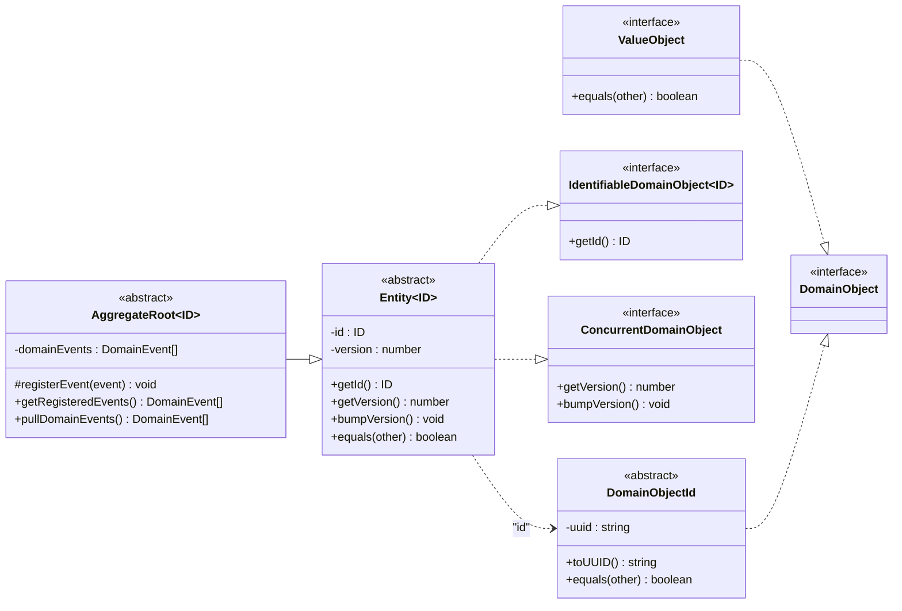
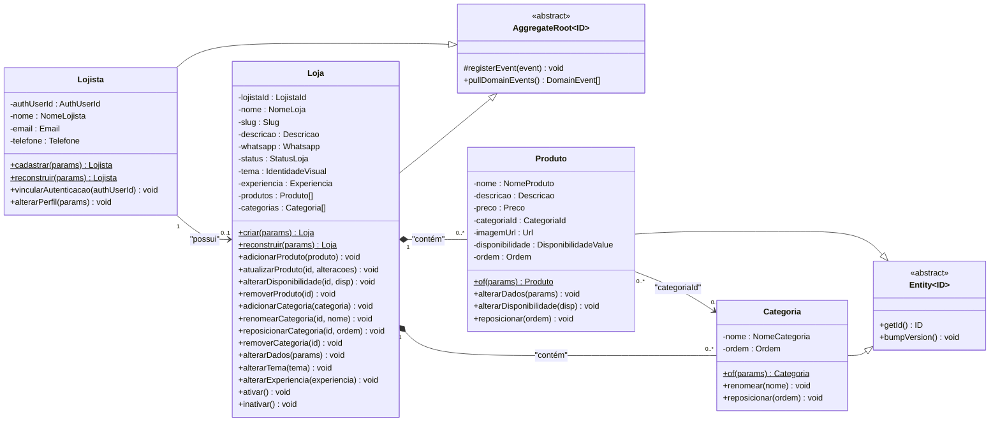
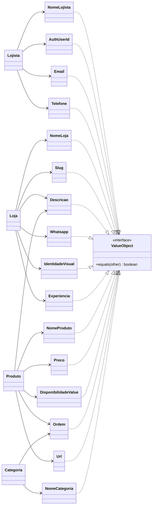
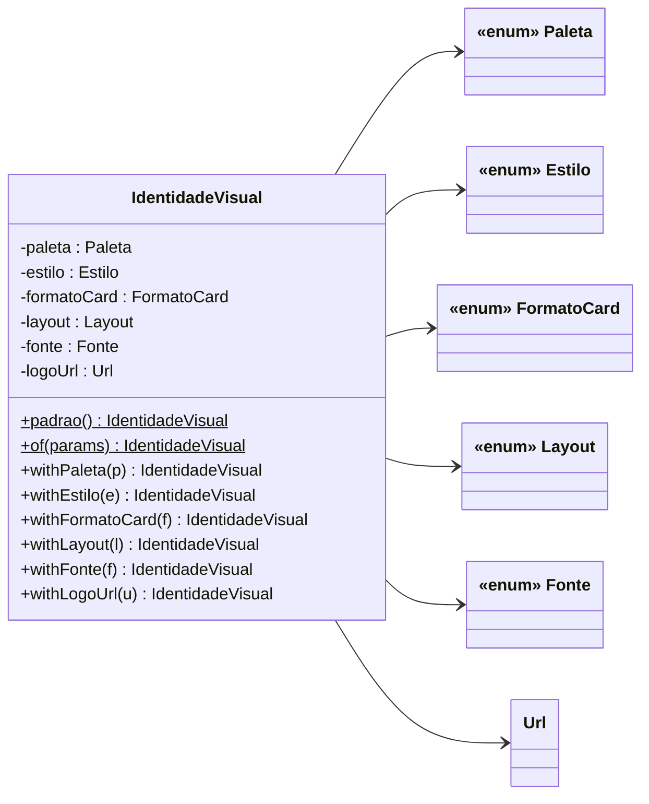
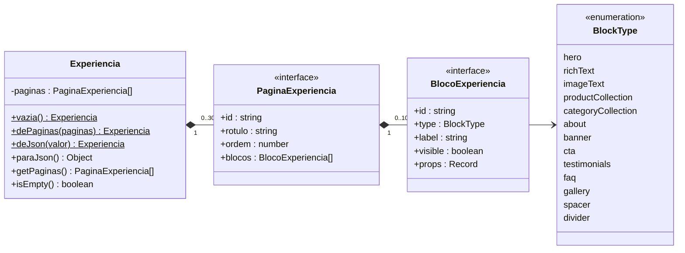
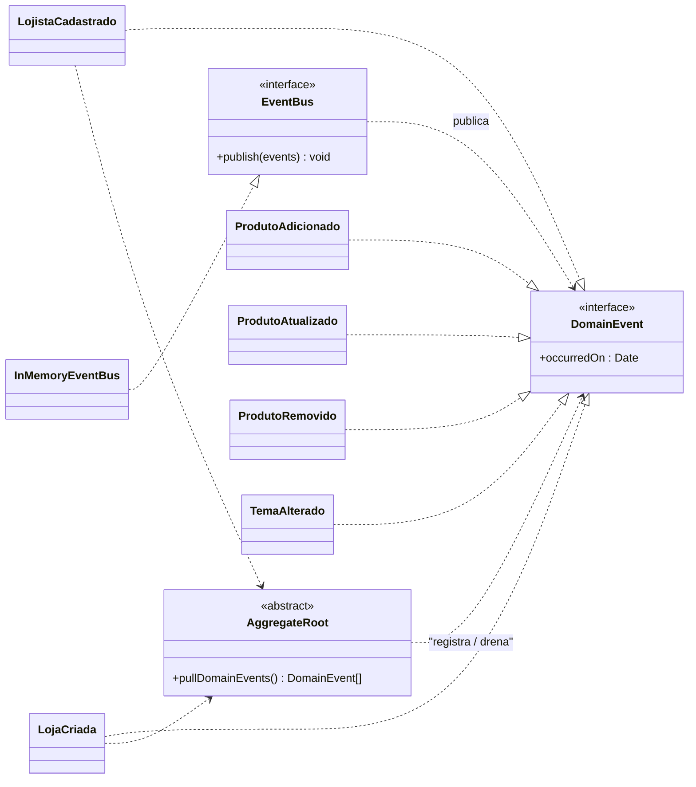

# 2. Diagrama de Classes (domínio DDD)

> Fonte: `src/kernel/ddd` e `src/modules/*/domain` · padrão DDD (agregados,
> entidades, value objects, eventos de domínio).

## 2.1 Abstrações do kernel (shared kernel)

## 2.2 Agregados e entidades

> `Lojista` e `Loja` são **raízes de agregado**. `Produto` e `Categoria` são
> entidades **internas** ao agregado `Loja` — nunca acessadas diretamente.

## 2.3 Value Objects por agregado

### `IdentidadeVisual` (objeto de valor composto)

### `Experiencia` (objeto de valor composto — documento JSON)

## 2.4 Eventos de domínio

## 2.5 Mapeamento domínio ↔ banco de dados

| Conceito de domínio | Representação persistida |
| --- | --- |
| `Lojista` (raiz de agregado) | tabela `usuarios` |
| `Loja` (raiz de agregado) | tabela `lojas` |
| `Produto` (entidade) | tabela `produtos` |
| `Categoria` (entidade) | tabela `categorias` |
| `DomainObjectId` | coluna `id` (`TEXT`, UUID v4) |
| `versao` / `@Version` (`ConcurrentDomainObject`) | `lojas.versao` (lock otimista) |
| `Email`, `Telefone`, `NomeLojista`, `AuthUserId` | `usuarios.email`, `.telefone`, `.nome`, `.authUserId` |
| `NomeLoja`, `Slug`, `Descricao`, `Whatsapp` | `lojas.nome`, `.slug`, `.descricao`, `.whatsapp` |
| `IdentidadeVisual` (VO composto) | colunas `lojas.temaPaleta`, `temaEstilo`, `temaFormatoCard`, `temaLayout`, `temaFonte`, `temaLogoUrl` (achatado) |
| `Experiencia` (VO composto) | `lojas.experiencia` (`JSONB`, documento versão 2) |
| `StatusLoja` | enum PostgreSQL `"StatusLoja"` |
| `NomeProduto`, `Preco`, `DisponibilidadeValue`, `Url`, `Ordem` | `produtos.nome`, `.precoCents`, `.disponivel`, `.imagemUrl`, `.ordem` |
| `NomeCategoria`, `Ordem` | `categorias.nome`, `.ordem` |

> O módulo `pedido` (`ItemPedido`, `PedidoFormatado`, `Quantidade`) **não possui
> tabela**: ele monta o texto do pedido e o link `wa.me` em memória.
