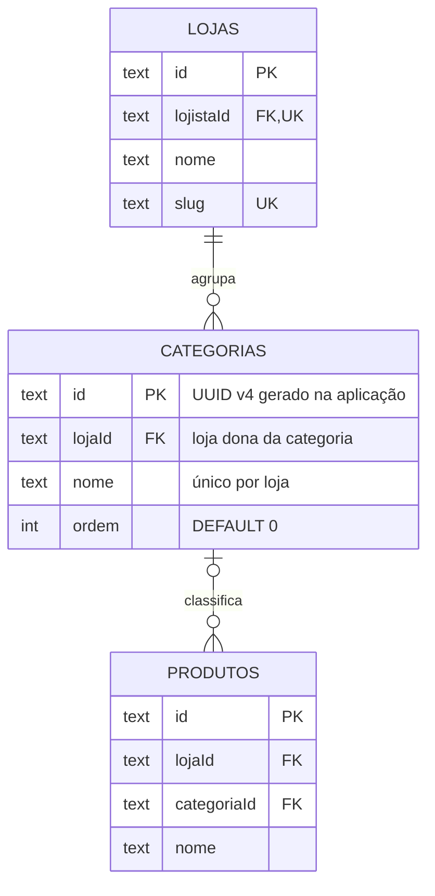

# Tabela `categorias`

**Modelo Prisma:** `Categoria` · **Classe de domínio:** `Categoria` (entidade do agregado `Loja`)
**Descrição:** agrupador de produtos da vitrine, com nome único por loja.

## Diagrama



## Dicionário de dados

| Coluna | Tipo PostgreSQL | Nulo | Default | Chave / Regra | Descrição |
| --- | --- | --- | --- | --- | --- |
| `id` | `TEXT` | NÃO | gerado na aplicação (UUID v4) | PK (`categorias_pkey`) | Identificador da categoria. |
| `lojaId` | `TEXT` | NÃO | — | FK → `lojas.id` | Loja dona da categoria. `ON DELETE CASCADE`. |
| `nome` | `TEXT` | NÃO | — | UNIQUE(`lojaId`, `nome`) | Nome da categoria. Não pode repetir dentro da mesma loja. |
| `ordem` | `INTEGER` | NÃO | `0` | — | Posição de ordenação na vitrine. |

## Índices e constraints

| Nome | Tipo | Colunas |
| --- | --- | --- |
| `categorias_pkey` | PRIMARY KEY | `id` |
| `categorias_lojaId_nome_key` | UNIQUE | `lojaId`, `nome` |
| `categorias_lojaId_idx` | INDEX | `lojaId` |
| `categorias_lojaId_fkey` | FOREIGN KEY | `lojaId` → `lojas(id)` |

## Regras de negócio associadas

- Não é possível ter duas categorias com o **mesmo nome na mesma loja**
  (`CategoriaDuplicada`) — garantido por índice único composto.
- A categoria é uma **entidade interna** do agregado `Loja`: só é criada,
  renomeada, reposicionada ou removida pela raiz (`adicionarCategoria`,
  `renomearCategoria`, `reposicionarCategoria`, `removerCategoria`).
- **Remover uma categoria não remove seus produtos**: a FK em `produtos` usa
  `ON DELETE SET NULL`, então os produtos passam a ficar sem categoria.
- Excluir a loja **cascateia** para suas categorias.
- `ordem` define a posição de exibição (menor valor primeiro).

## DDL (gerado pelo Prisma)

```sql
CREATE TABLE "categorias" (
    "id" TEXT NOT NULL,
    "lojaId" TEXT NOT NULL,
    "nome" TEXT NOT NULL,
    "ordem" INTEGER NOT NULL DEFAULT 0,
    CONSTRAINT "categorias_pkey" PRIMARY KEY ("id")
);

CREATE INDEX "categorias_lojaId_idx" ON "categorias"("lojaId");
CREATE UNIQUE INDEX "categorias_lojaId_nome_key" ON "categorias"("lojaId", "nome");

ALTER TABLE "categorias" ADD CONSTRAINT "categorias_lojaId_fkey"
    FOREIGN KEY ("lojaId") REFERENCES "lojas"("id")
    ON DELETE CASCADE ON UPDATE CASCADE;
```
