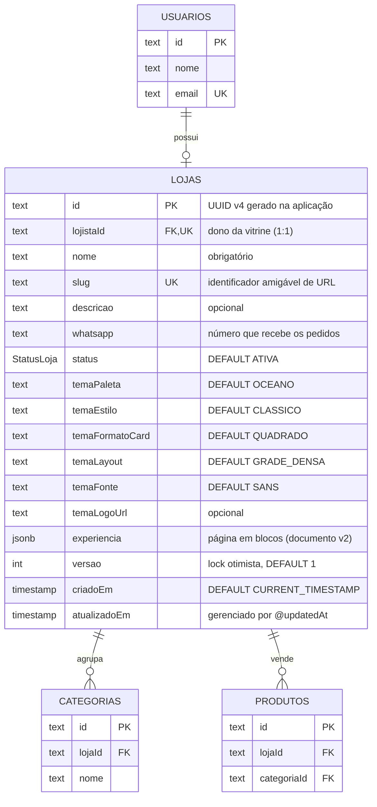

# Tabela `lojas`

**Modelo Prisma:** `Loja` · **Classe de domínio:** `Loja` (raiz do agregado central)
**Descrição:** a vitrine do lojista — dados públicos, identidade visual (tema) e
página em blocos (`experiencia`).

## Diagrama



## Dicionário de dados

| Coluna | Tipo PostgreSQL | Nulo | Default | Chave / Regra | Descrição |
| --- | --- | --- | --- | --- | --- |
| `id` | `TEXT` | NÃO | gerado na aplicação (UUID v4) | PK (`lojas_pkey`) | Identificador da vitrine. |
| `lojistaId` | `TEXT` | NÃO | — | FK → `usuarios.id`, UNIQUE | Dono da vitrine. Único garante 1 loja por lojista. `ON DELETE CASCADE`. |
| `nome` | `TEXT` | NÃO | — | — | Nome da marca/vitrine. |
| `slug` | `TEXT` | NÃO | — | UNIQUE (`lojas_slug_key`) | Identificador amigável para URL (ex.: `minha-loja`). Único global. |
| `descricao` | `TEXT` | SIM | — | — | Descrição/apresentação da marca. |
| `whatsapp` | `TEXT` | NÃO | — | — | Número de WhatsApp que recebe os pedidos. |
| `status` | `"StatusLoja"` | NÃO | `'ATIVA'` | enum | Estado operacional: `ATIVA` ou `INATIVA`. |
| `temaPaleta` | `TEXT` | NÃO | `'OCEANO'` | enum de aplicação | Combo de cores: `OCEANO`, `ESMERALDA`, `BLUSH`, `TERRA`, `LILAS`, `CARVAO`. |
| `temaEstilo` | `TEXT` | NÃO | `'CLASSICO'` | enum de aplicação | Tom visual: `CLASSICO`, `MODERNO`, `MINIMAL`, `VIBRANTE`. |
| `temaFormatoCard` | `TEXT` | NÃO | `'QUADRADO'` | enum de aplicação | Proporção do card: `QUADRADO`, `RETRATO`, `PANORAMICO`. |
| `temaLayout` | `TEXT` | NÃO | `'GRADE_DENSA'` | enum de aplicação | Layout da grade: `GRADE_DENSA`, `GRADE_LARGA`, `LISTA`, `DESTAQUE`. |
| `temaFonte` | `TEXT` | NÃO | `'SANS'` | enum de aplicação | Tipografia: `SANS`, `MANROPE`, `SERIF`, `DISPLAY`, `MONO`. |
| `temaLogoUrl` | `TEXT` | SIM | — | — | URL do logotipo (bucket `vitrine-imagens`). |
| `experiencia` | `JSONB` | SIM | — | documento v2 | Página da vitrine em blocos. Ver [`04-enums-e-storage.md`](../04-enums-e-storage.md). |
| `versao` | `INTEGER` | NÃO | `1` | lock otimista (`@Version`) | Contador incrementado a cada atualização. |
| `criadoEm` | `TIMESTAMP(3)` | NÃO | `CURRENT_TIMESTAMP` | — | Data/hora de criação. |
| `atualizadoEm` | `TIMESTAMP(3)` | NÃO | gerenciado pelo Prisma | `@updatedAt` | Data/hora da última atualização. |

## Índices e constraints

| Nome | Tipo | Colunas |
| --- | --- | --- |
| `lojas_pkey` | PRIMARY KEY | `id` |
| `lojas_lojistaId_key` | UNIQUE | `lojistaId` |
| `lojas_slug_key` | UNIQUE | `slug` |
| `lojas_lojistaId_idx` | INDEX | `lojistaId` |
| `lojas_slug_idx` | INDEX | `slug` |
| `lojas_lojistaId_fkey` | FOREIGN KEY | `lojistaId` → `usuarios(id)` |

## Regras de negócio associadas

- **Agregado central**: `Produto` e `Categoria` só existem dentro de uma loja e
  são gerenciados exclusivamente pela raiz `Loja`.
- `slug` é validado e único (`SlugJaEmUso`); é o endereço público da vitrine.
- O tema é composto por **combos predefinidos** (não cores livres) — decisão de
  design system; a paleta é resolvida na apresentação.
- `versao` implementa **concorrência otimista**: atualizações com versão
  divergente lançam `DadosDesatualizados`.
- `status = INATIVA` tira a vitrine do ar sem apagar os dados.
- Excluir a loja **cascateia** para suas categorias e produtos.

## DDL (gerado pelo Prisma)

```sql
CREATE TABLE "lojas" (
    "id" TEXT NOT NULL,
    "lojistaId" TEXT NOT NULL,
    "nome" TEXT NOT NULL,
    "slug" TEXT NOT NULL,
    "descricao" TEXT,
    "whatsapp" TEXT NOT NULL,
    "status" "StatusLoja" NOT NULL DEFAULT 'ATIVA',
    "temaPaleta" TEXT NOT NULL DEFAULT 'OCEANO',
    "temaEstilo" TEXT NOT NULL DEFAULT 'CLASSICO',
    "temaFormatoCard" TEXT NOT NULL DEFAULT 'QUADRADO',
    "temaLayout" TEXT NOT NULL DEFAULT 'GRADE_DENSA',
    "temaFonte" TEXT NOT NULL DEFAULT 'SANS',
    "temaLogoUrl" TEXT,
    "experiencia" JSONB,
    "versao" INTEGER NOT NULL DEFAULT 1,
    "criadoEm" TIMESTAMP(3) NOT NULL DEFAULT CURRENT_TIMESTAMP,
    "atualizadoEm" TIMESTAMP(3) NOT NULL,
    CONSTRAINT "lojas_pkey" PRIMARY KEY ("id")
);

CREATE UNIQUE INDEX "lojas_lojistaId_key" ON "lojas"("lojistaId");
CREATE UNIQUE INDEX "lojas_slug_key" ON "lojas"("slug");
CREATE INDEX "lojas_lojistaId_idx" ON "lojas"("lojistaId");
CREATE INDEX "lojas_slug_idx" ON "lojas"("slug");

ALTER TABLE "lojas" ADD CONSTRAINT "lojas_lojistaId_fkey"
    FOREIGN KEY ("lojistaId") REFERENCES "usuarios"("id")
    ON DELETE CASCADE ON UPDATE CASCADE;
```
