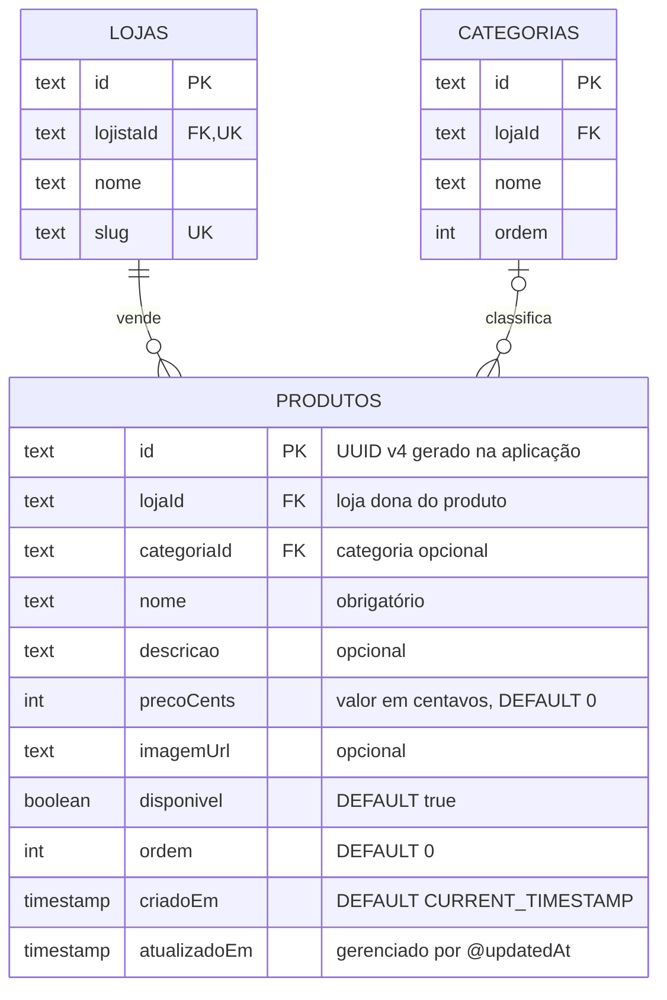

# Tabela `produtos`

**Modelo Prisma:** `Produto` · **Classe de domínio:** `Produto` (entidade do agregado `Loja`)
**Descrição:** item do catálogo da vitrine, opcionalmente vinculado a uma categoria.

## Diagrama



## Dicionário de dados

| Coluna | Tipo PostgreSQL | Nulo | Default | Chave / Regra | Descrição |
| --- | --- | --- | --- | --- | --- |
| `id` | `TEXT` | NÃO | gerado na aplicação (UUID v4) | PK (`produtos_pkey`) | Identificador do produto. |
| `lojaId` | `TEXT` | NÃO | — | FK → `lojas.id` | Loja dona do produto. `ON DELETE CASCADE`. |
| `categoriaId` | `TEXT` | SIM | — | FK → `categorias.id` | Categoria do produto (opcional). `ON DELETE SET NULL`. |
| `nome` | `TEXT` | NÃO | — | — | Nome do produto. |
| `descricao` | `TEXT` | SIM | — | — | Descrição do produto. |
| `precoCents` | `INTEGER` | NÃO | `0` | `>= 0` (domínio) | Preço em **centavos** (inteiro), para evitar erro de ponto flutuante. |
| `imagemUrl` | `TEXT` | SIM | — | — | URL da imagem (bucket `vitrine-imagens`). |
| `disponivel` | `BOOLEAN` | NÃO | `true` | — | Exibe (`true`) ou oculta (`false`) o produto na vitrine. |
| `ordem` | `INTEGER` | NÃO | `0` | — | Posição de ordenação na vitrine. |
| `criadoEm` | `TIMESTAMP(3)` | NÃO | `CURRENT_TIMESTAMP` | — | Data/hora de criação. |
| `atualizadoEm` | `TIMESTAMP(3)` | NÃO | gerenciado pelo Prisma | `@updatedAt` | Data/hora da última atualização. |

## Índices e constraints

| Nome | Tipo | Colunas |
| --- | --- | --- |
| `produtos_pkey` | PRIMARY KEY | `id` |
| `produtos_lojaId_idx` | INDEX | `lojaId` |
| `produtos_categoriaId_idx` | INDEX | `categoriaId` |
| `produtos_lojaId_fkey` | FOREIGN KEY | `lojaId` → `lojas(id)` |
| `produtos_categoriaId_fkey` | FOREIGN KEY | `categoriaId` → `categorias(id)` |

## Regras de negócio associadas

- Produto é uma **entidade interna** do agregado `Loja`: criado/alterado/removido
  pela raiz (`adicionarProduto`, `atualizarProduto`, `alterarDisponibilidade`,
  `removerProduto`).
- Ao adicionar/atualizar, a categoria referenciada **precisa existir** na loja
  (`CategoriaNaoEncontrada`).
- `precoCents` é inteiro não negativo (`PrecoInvalido`); a formatação para BRL
  ocorre na apresentação.
- `disponivel = false` mantém o produto no banco, mas o esconde na vitrine.
- Remover uma categoria **desvincula** (`categoriaId = NULL`) os produtos, sem
  removê-los.
- Excluir a loja **cascateia** para seus produtos.

## DDL (gerado pelo Prisma)

```sql
CREATE TABLE "produtos" (
    "id" TEXT NOT NULL,
    "lojaId" TEXT NOT NULL,
    "categoriaId" TEXT,
    "nome" TEXT NOT NULL,
    "descricao" TEXT,
    "precoCents" INTEGER NOT NULL DEFAULT 0,
    "imagemUrl" TEXT,
    "disponivel" BOOLEAN NOT NULL DEFAULT true,
    "ordem" INTEGER NOT NULL DEFAULT 0,
    "criadoEm" TIMESTAMP(3) NOT NULL DEFAULT CURRENT_TIMESTAMP,
    "atualizadoEm" TIMESTAMP(3) NOT NULL,
    CONSTRAINT "produtos_pkey" PRIMARY KEY ("id")
);

CREATE INDEX "produtos_lojaId_idx" ON "produtos"("lojaId");
CREATE INDEX "produtos_categoriaId_idx" ON "produtos"("categoriaId");

ALTER TABLE "produtos" ADD CONSTRAINT "produtos_lojaId_fkey"
    FOREIGN KEY ("lojaId") REFERENCES "lojas"("id")
    ON DELETE CASCADE ON UPDATE CASCADE;

ALTER TABLE "produtos" ADD CONSTRAINT "produtos_categoriaId_fkey"
    FOREIGN KEY ("categoriaId") REFERENCES "categorias"("id")
    ON DELETE SET NULL ON UPDATE CASCADE;
```
