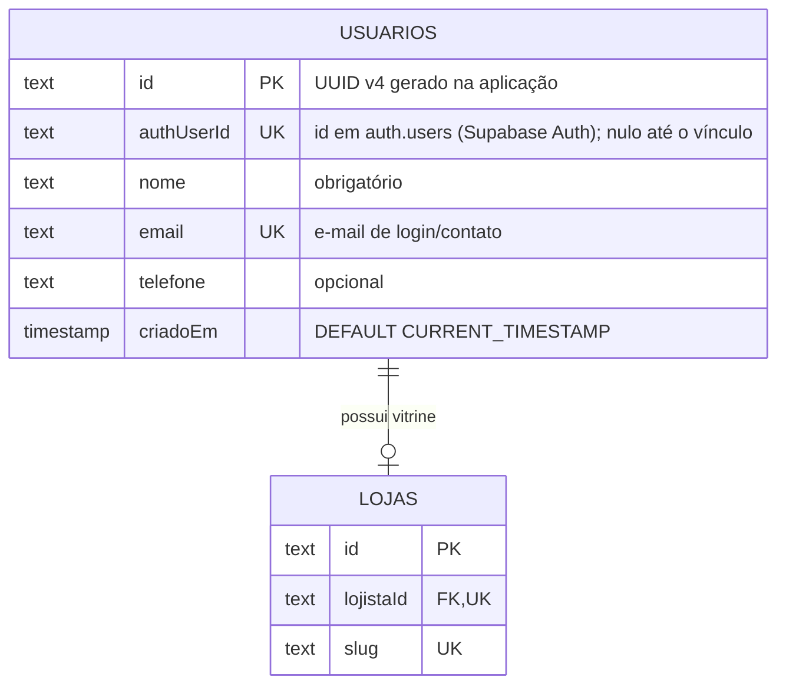

# Tabela `usuarios`

**Modelo Prisma:** `Usuario` · **Classe de domínio:** `Lojista` (raiz do agregado do lojista)
**Descrição:** identidade do dono da vitrine e vínculo com o Supabase Auth.

## Diagrama



## Dicionário de dados

| Coluna | Tipo PostgreSQL | Nulo | Default | Chave / Regra | Descrição |
| --- | --- | --- | --- | --- | --- |
| `id` | `TEXT` | NÃO | gerado na aplicação (UUID v4) | PK (`usuarios_pkey`) | Identificador do lojista. |
| `authUserId` | `TEXT` | SIM | — | UNIQUE (`usuarios_authUserId_key`) | Identificador do usuário no Supabase Auth. Nulo antes do vínculo; único quando presente. |
| `nome` | `TEXT` | NÃO | — | — | Nome do lojista. |
| `email` | `TEXT` | NÃO | — | UNIQUE (`usuarios_email_key`) | E-mail único do lojista, usado no login e no contato. |
| `telefone` | `TEXT` | SIM | — | — | Telefone de contato (opcional). |
| `criadoEm` | `TIMESTAMP(3)` | NÃO | `CURRENT_TIMESTAMP` | — | Data/hora de cadastro. |

## Índices e constraints

| Nome | Tipo | Colunas |
| --- | --- | --- |
| `usuarios_pkey` | PRIMARY KEY | `id` |
| `usuarios_authUserId_key` | UNIQUE | `authUserId` |
| `usuarios_email_key` | UNIQUE | `email` |

## Regras de negócio associadas

- Cada lojista possui **no máximo uma** vitrine — garantido pela unicidade de
  `lojas.lojistaId` (relação 1:1 controlada pela tabela `lojas`).
- `email` é chave natural de login e não pode repetir (`EmailJaCadastrado`).
- Excluir um usuário **cascateia** a exclusão da sua loja.
- O `authUserId` só é preenchido após o vínculo com o Supabase Auth
  (`VincularAutenticacao`).

## DDL (gerado pelo Prisma)

```sql
CREATE TABLE "usuarios" (
    "id" TEXT NOT NULL,
    "authUserId" TEXT,
    "nome" TEXT NOT NULL,
    "email" TEXT NOT NULL,
    "telefone" TEXT,
    "criadoEm" TIMESTAMP(3) NOT NULL DEFAULT CURRENT_TIMESTAMP,
    CONSTRAINT "usuarios_pkey" PRIMARY KEY ("id")
);

CREATE UNIQUE INDEX "usuarios_authUserId_key" ON "usuarios"("authUserId");
CREATE UNIQUE INDEX "usuarios_email_key" ON "usuarios"("email");
```
