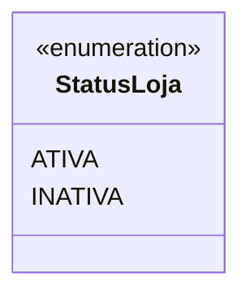
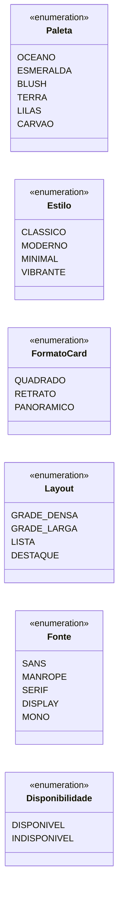
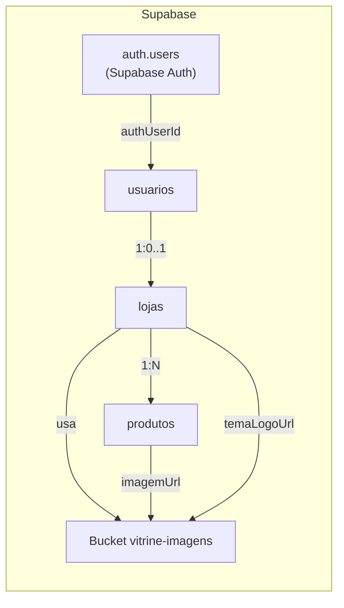

# 4. Enums, JSON e Storage

## 4.1 Enum nativo do PostgreSQL — `StatusLoja`

Único enum realmente criado no banco. O DDL do Prisma emite:

```sql
CREATE TYPE "StatusLoja" AS ENUM ('ATIVA', 'INATIVA');
```



| Valor | Significado |
| --- | --- |
| `ATIVA` | Vitrine publicada e visível ao público (padrão). |
| `INATIVA` | Vitrine fora do ar, sem apagar os dados. |

## 4.2 Enums de aplicação persistidos como `TEXT`

Esses valores **não** são enums de banco: são colunas `TEXT` com `DEFAULT`,
validadas no domínio (objeto de valor `IdentidadeVisual`). Modelagem "combos
predefinidos, sem cores livres".



| Coluna | Tipo | Valores possíveis | Default | Validação no domínio |
| --- | --- | --- | --- | --- |
| `lojas.temaPaleta` | `TEXT` | `OCEANO`, `ESMERALDA`, `BLUSH`, `TERRA`, `LILAS`, `CARVAO` | `OCEANO` | `parsePaleta` |
| `lojas.temaEstilo` | `TEXT` | `CLASSICO`, `MODERNO`, `MINIMAL`, `VIBRANTE` | `CLASSICO` | `parseEstilo` |
| `lojas.temaFormatoCard` | `TEXT` | `QUADRADO`, `RETRATO`, `PANORAMICO` | `QUADRADO` | `parseFormatoCard` |
| `lojas.temaLayout` | `TEXT` | `GRADE_DENSA`, `GRADE_LARGA`, `LISTA`, `DESTAQUE` | `GRADE_DENSA` | `parseLayout` |
| `lojas.temaFonte` | `TEXT` | `SANS`, `MANROPE`, `SERIF`, `DISPLAY`, `MONO` | `SANS` | `parseFonte` |
| `produtos.disponivel` | `BOOLEAN` | `true` / `false` | `true` | `DisponibilidadeValue` |

> Um valor inválido gravado diretamente no banco causaria `OpcaoVisualInvalida`
> ou `FonteInvalida` ao reconstruir a entidade.

## 4.3 Documento JSON `lojas.experiencia`

Coluna `JSONB`, anulável, que guarda a **página da vitrine em blocos**
(construtor visual). Documento na versão `2`, validado por schema Zod
(`ExperienciaSchema`).

### Estrutura

```json
{
  "versao": 2,
  "paginas": [
    {
      "id": "home-1",
      "rotulo": "Home",
      "ordem": 0,
      "blocos": [
        {
          "id": "hero-1",
          "type": "hero",
          "label": "Apresentação da marca",
          "visible": true,
          "props": {
            "title": "Sua marca, do seu jeito",
            "description": "Conte a história...",
            "action": "Ver produtos",
            "buttonVisible": true
          }
        }
      ]
    }
  ]
}
```

### Campos

| Campo | Tipo | Regra | Descrição |
| --- | --- | --- | --- |
| `versao` | `number` | literal `2` | Versão do documento (controle de compatibilidade). |
| `paginas` | `array` | 1..30 | Páginas da vitrine. |
| `paginas[].id` | `string` | não vazio | Identificador da página. |
| `paginas[].rotulo` | `string` | 1..24 caracteres | Nome exibido na navegação. |
| `paginas[].ordem` | `number` | inteiro ≥ 0 | Ordem de exibição. |
| `paginas[].blocos` | `array` | 0..100 | Blocos da página. |
| `blocos[].id` | `string` | não vazio | Identificador do bloco. |
| `blocos[].type` | `string` | ver tabela abaixo | Tipo do bloco. |
| `blocos[].label` | `string` | — | Rótulo do bloco no editor. |
| `blocos[].visible` | `boolean` | — | Exibe/oculta o bloco. |
| `blocos[].props` | `object` | por tipo | Propriedades específicas do tipo. |

### Tipos de bloco e `props`

| `type` | Plano | `props` |
| --- | --- | --- |
| `hero` | ESSENCIAL | `title`, `description`, `action`, `buttonVisible` |
| `richText` | ESSENCIAL | `title`, `body`, `align` (`left`/`center`) |
| `imageText` | ESSENCIAL | `title`, `body`, `imageUrl`, `imageSide` (`left`/`right`) |
| `productCollection` | ESSENCIAL | `title`, `mode` (`manual`/`automatic`/`hybrid`), `order` (`newest`/`priceAsc`/`priceDesc`/`name`/`manual`), `categoryId`, `manualIds`, `limit` (1..50) |
| `categoryCollection` | ESSENCIAL | `title`, `limit` (1..12) |
| `about` | ESSENCIAL | `title`, `body` |
| `banner` | LIVRE | `title`, `description`, `action` |
| `cta` | LIVRE | `title`, `description`, `action` |
| `testimonials` | LIVRE | `title`, `items[{ nome, texto }]` |
| `faq` | LIVRE | `title`, `items[{ pergunta, resposta }]` |
| `gallery` | LIVRE | `title`, `images[]` |
| `spacer` | LIVRE | `height` (4..160) |
| `divider` | LIVRE | — |

### Compatibilidade

`Experiencia.deJson` aceita o formato antigo (array simples de blocos) e o
converte para o documento v2 com uma página `Home`. Documentos nulos ou vazios
viram `Experiencia.vazia()`.

## 4.4 Supabase Storage — bucket `vitrine-imagens`

Não é uma tabela do domínio (vive no schema `storage`, gerenciado pelo
Supabase), mas faz parte do modelo de dados por armazenar as imagens de produto
e logotipo.

| Item | Valor |
| --- | --- |
| Bucket | `vitrine-imagens` |
| Visibilidade | público (`public = true`) |
| Convenção de pastas | `produtos/` e `logos/` |
| Leitura | pública (`anon`, `authenticated`) |
| Escrita | apenas autenticado, restrito às pastas `produtos/` e `logos/` |

```sql
-- Bucket público
insert into storage.buckets (id, name, public)
values ('vitrine-imagens', 'vitrine-imagens', true)
on conflict (id) do nothing;

-- RLS: leitura pública
create policy "Imagens de vitrine são públicas"
on storage.objects for select
to anon, authenticated
using ( bucket_id = 'vitrine-imagens' );

-- RLS: upload apenas por usuário autenticado, isolado por tipo
create policy "Lojista pode enviar imagens"
on storage.objects for insert
to authenticated
with check (
  bucket_id = 'vitrine-imagens'
  and (storage.foldername(name))[1] in ('produtos', 'logos')
);
```

### Diagrama de armazenamento



> As colunas `produtos.imagemUrl` e `lojas.temaLogoUrl` guardam apenas a URL; os
> bytes ficam no bucket.
