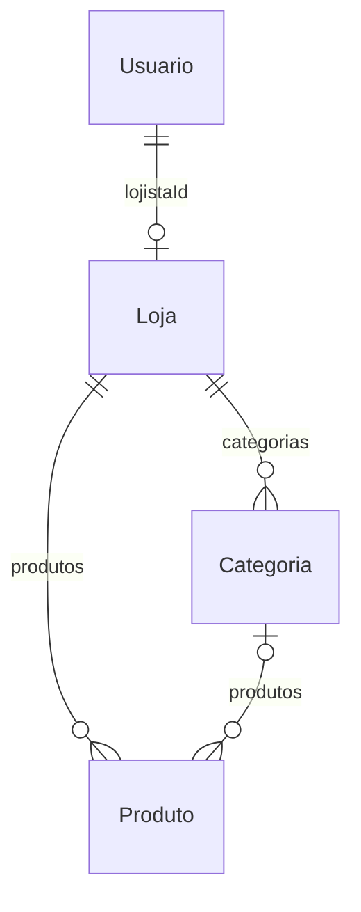

# 5. Schema Prisma — documentação automática (`prisma-markdown`)

> Espelho da saída da ferramenta [`prisma-markdown`](https://github.com/samchon/prisma-markdown)
> sobre `prisma/schema.prisma`: ERD Mermaid + uma tabela de propriedades por modelo.
> As descrições vêm dos comentários `///` do schema.

## ERD



## Como regenerar

```bash
# 1) instalar (uma vez)
npm i -D prisma-markdown

# 2) configurar em package.json
#   "prisma-markdown": {
#     "prisma": "prisma/schema.prisma",
#     "output": "docs/database/ERD.md",
#     "namespace": []
#   }

# 3) gerar
npx prisma-markdown
```

## `Usuario`

Identidade do lojista (dono da vitrine). Vinculado ao Supabase Auth via `authUserId`.

Tabela: **`usuarios`**

| Propriedade | Tipo | Nulo | Atributos | Descrição |
| --- | --- | --- | --- | --- |
| `id` | `String` | não | `@id @default(uuid())` | Identificador do lojista (UUID v4). |
| `authUserId` | `String` | sim | `@unique` | ID do usuário no Supabase Auth. |
| `nome` | `String` | não | — | Nome do lojista. |
| `email` | `String` | não | `@unique` | E-mail único de login/contato. |
| `telefone` | `String` | sim | — | Telefone de contato. |
| `criadoEm` | `DateTime` | não | `@default(now())` | Data de cadastro. |
| `loja` | `Loja?` | sim | relação 1:1 | Vitrine do lojista. |

## `Loja`

Vitrine: agregado central. Cada lojista possui exatamente uma loja.

Tabela: **`lojas`**

| Propriedade | Tipo | Nulo | Atributos | Descrição |
| --- | --- | --- | --- | --- |
| `id` | `String` | não | `@id @default(uuid())` | Identificador da vitrine. |
| `lojistaId` | `String` | não | `@unique` | FK para `usuarios.id` (`onDelete: Cascade`). |
| `lojista` | `Usuario` | não | relação | Dono da vitrine. |
| `nome` | `String` | não | — | Nome da marca/vitrine. |
| `slug` | `String` | não | `@unique` | Identificador amigável de URL. |
| `descricao` | `String` | sim | — | Apresentação da marca. |
| `whatsapp` | `String` | não | — | WhatsApp que recebe pedidos. |
| `status` | `StatusLoja` | não | `@default(ATIVA)` | Estado operacional. |
| `temaPaleta` | `String` | não | `@default("OCEANO")` | Combo de cores. |
| `temaEstilo` | `String` | não | `@default("CLASSICO")` | Tom visual. |
| `temaFormatoCard` | `String` | não | `@default("QUADRADO")` | Proporção do card. |
| `temaLayout` | `String` | não | `@default("GRADE_DENSA")` | Layout da grade. |
| `temaFonte` | `String` | não | `@default("SANS")` | Tipografia. |
| `temaLogoUrl` | `String` | sim | — | URL do logotipo. |
| `experiencia` | `Json` | sim | — | Página em blocos (`JSONB`, v2). |
| `versao` | `Int` | não | `@default(1)` | Lock otimista (`@Version`). |
| `criadoEm` | `DateTime` | não | `@default(now())` | Data de criação. |
| `atualizadoEm` | `DateTime` | não | `@updatedAt` | Última atualização. |
| `produtos` | `Produto[]` | — | relação 1:N | Produtos da vitrine. |
| `categorias` | `Categoria[]` | — | relação 1:N | Categorias da vitrine. |

Índices: `@@index([lojistaId])`, `@@index([slug])`.

## `Categoria`

Agrupador de produtos da vitrine (entidade do agregado `Loja`).

Tabela: **`categorias`**

| Propriedade | Tipo | Nulo | Atributos | Descrição |
| --- | --- | --- | --- | --- |
| `id` | `String` | não | `@id @default(uuid())` | Identificador da categoria. |
| `lojaId` | `String` | não | — | FK para `lojas.id` (`onDelete: Cascade`). |
| `loja` | `Loja` | não | relação | Loja dona da categoria. |
| `nome` | `String` | não | — | Nome (único por loja). |
| `ordem` | `Int` | não | `@default(0)` | Ordem de exibição. |
| `produtos` | `Produto[]` | — | relação 1:N | Produtos classificados. |

Restrições: `@@unique([lojaId, nome])`, `@@index([lojaId])`.

## `Produto`

Item do catálogo da vitrine (entidade do agregado `Loja`).

Tabela: **`produtos`**

| Propriedade | Tipo | Nulo | Atributos | Descrição |
| --- | --- | --- | --- | --- |
| `id` | `String` | não | `@id @default(uuid())` | Identificador do produto. |
| `lojaId` | `String` | não | — | FK para `lojas.id` (`onDelete: Cascade`). |
| `loja` | `Loja` | não | relação | Loja dona do produto. |
| `categoriaId` | `String` | sim | — | FK para `categorias.id` (`onDelete: SetNull`). |
| `categoria` | `Categoria?` | sim | relação | Categoria do produto. |
| `nome` | `String` | não | — | Nome do produto. |
| `descricao` | `String` | sim | — | Descrição. |
| `precoCents` | `Int` | não | `@default(0)` | Preço em centavos. |
| `imagemUrl` | `String` | sim | — | URL da imagem. |
| `disponivel` | `Boolean` | não | `@default(true)` | Visível na vitrine. |
| `ordem` | `Int` | não | `@default(0)` | Ordem de exibição. |
| `criadoEm` | `DateTime` | não | `@default(now())` | Data de criação. |
| `atualizadoEm` | `DateTime` | não | `@updatedAt` | Última atualização. |

Índices: `@@index([lojaId])`, `@@index([categoriaId])`.

## Enum `StatusLoja`

| Valor | Descrição |
| --- | --- |
| `ATIVA` | Vitrine publicada. |
| `INATIVA` | Vitrine fora do ar. |
